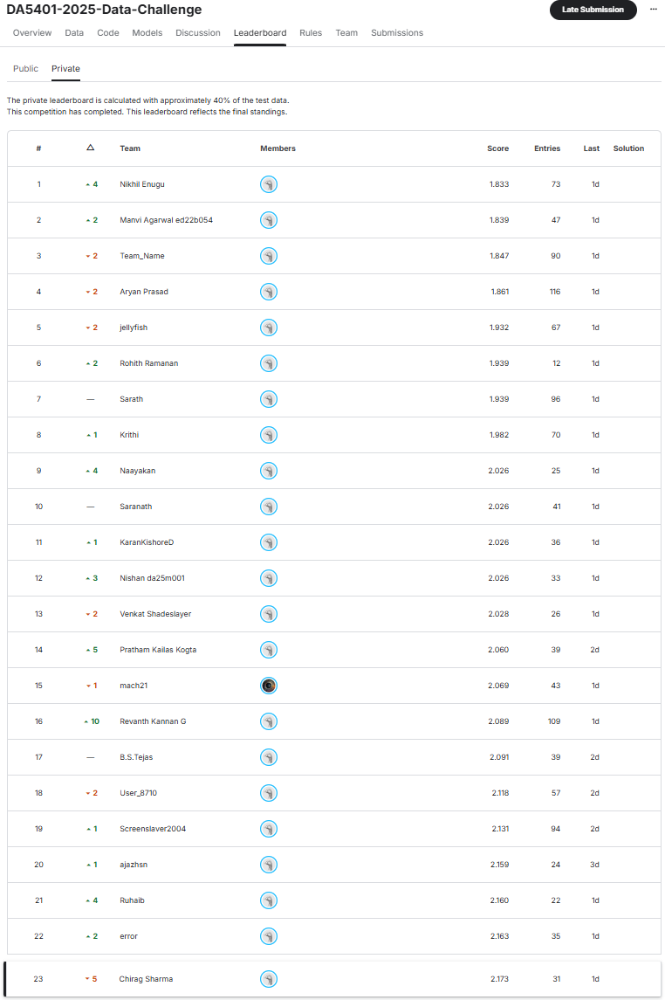

# **AI Metric Fitness Prediction — Tri-Encoder Modelling & Augmentation Framework**

## **Project Author**

Name: Chirag

RollNo: DA25M008

---

## **Overview**

This project develops a learning system for **predicting LLM-judge fitness scores** (0–10) for conversational AI responses, given:

1. A **metric definition** (provided as a precomputed embedding)
2. A (system prompt, user prompt, model response) **prompt–response pair**

The dataset—constructed from multilingual curated evaluations—captures how well an AI response aligns with the intended metric objective.
The goal is to train a model that **maps metric embeddings + text embeddings → fitness score** with the lowest possible RMSE on the hidden test set.

The project explores **over 30 modelling setups** and introduces a highly effective **embedding-level augmentation strategy**.
Ultimately, the best results are achieved by a **two-model ensemble** combining an attention-based tri-encoder with a deep hybrid ordinal–regression model.

---

## **Dataset Description**

### **Files Provided**

* `train_data.json` — 5000 samples with target scores
* `test_data.json` — 3638 samples (no scores)
* `metric_names.json` — list of 145 metric identifiers
* `metric_name_embeddings.npy` — (145 × 768) embeddings for each metric

### **Languages Present**

Multilingual prompts/responses in:

* English
* Hindi
* Tamil
* Bengali
* Assamese
* Bodo
* Sindhi

### **Problem Type**

A **regression task**, though ordinal structure and distributional patterns of the score allow hybrid modelling strategies.

---

## **Methodology**

### **1. Embedding Pipeline**

Two embedding streams are used:

* **Metric embeddings** (given):
  Provided via `google/embeddinggemma-300m`
* **Prompt & Response embeddings** (computed):
  Generated using `sentence-transformers/paraphrase-multilingual-MiniLM-L12-v2`

Each training example is converted into:

* Prompt embedding **p**
* Response embedding **r**
* Metric embedding **m**

### **2. Tri-Encoder Feature Engineering**

A combined feature vector (~3456 dims) is built from:

* Raw embeddings (p, r, m)
* Cross-interactions:

  * (|p - r|), (p \cdot r)
  * (|m - r|), (m \cdot r)
  * (|m - p|), (m \cdot p)

This tri-modal representation is the foundation of all downstream models.

---

## **3. Embedding-Level Augmentation (Key Innovation)**

To counter the **heavy score imbalance** and limited dataset size, a custom augmentation strategy was devised:

1. **Prompt shuffle negatives**
2. **Noise-corrupted response embeddings**
3. **Metric-swap negatives**

This process expands data from **5000 → 20,000 samples**, improving generalisation and stabilising training.

Two augmentation configurations were tested:

* **Setup A**: 15K augmented samples targeting low scores (1–3)
* **Setup B**: Balanced augmentation across low/mid ranges (1–3 and 4–7)

This augmentation proved critical to the top-performing models.

---

## **4. Models Implemented**

More than thirty modelling approaches were attempted, including:

* Classical ML: k-NN, Random Forests, Boosting
* Ordinal regression models
* MuZero-style threshold models
* Residual MLPs, LayerNorm MLPs
* Factorised tri-encoders
* Transformer-based attention tri-encoders
* Multi-task hybrids (ordinal + regression + distributional heads)

### **Final Two Models Used in the Ensemble**

#### **Model A — Attention Tri-Encoder (Ordinal)**

* Multi-token transformer encoder over (p, r, m)
* Outputs 9 sigmoid thresholds → expected score
* Very smooth, stable predictions

#### **Model B — Hybrid Ordinal–Regression–Distribution Model**

* Deep residual SwiGLU backbone
* Three prediction heads
* Learnable convex fusion of heads
* Produces highly accurate but slightly higher-variance outputs

### **Model 6 (Final System)**

A **2-way softmax combiner** learns the optimal convex mixture between Model A and Model B on a hold-out validation split.

This ensemble achieved the **best RMSE** on both leaderboard phases.

---

## **Evaluation Metric**

The competition evaluates predictions using:

### **✔ Root Mean Squared Error (RMSE)**

with lower values indicating better alignment with the LLM judge.

Validation RMSE, submission histograms, and leaderboard comparisons were used throughout experimentation.

---

## **Results Summary**

| Rank  | Model                                              | Notes                                     |
| ----- | -------------------------------------------------- | ----------------------------------------- |
| **1** | **Model 6 — Attention + Hybrid (Convex Ensemble)** | Best performance (public + private LB)    |
| **2** | Model 2 — Residual SwiGLU Regressor                | Most efficient + near top performance     |
| 3     | Model 3 — Hybrid Multi-Head                        | Strong but unstable during training       |
| 4     | Model 5 — Attention-Only Ordinal                   | Very stable but slightly under predictive |
| 5     | Model 1 — Factorised Tri-Encoder                   | Underpowered for deeper structure         |
| 6     | k-NN                                               | Baseline; weak generalisation             |

---

## **Key Insights**

* Custom **tri-encoder features** drastically outperform raw embedding concatenation.
* **Embedding-level augmentation** was the single largest performance booster.
* Treating the problem as **ordinal regression** (rather than pure regression) improved both stability and accuracy.
* The final **convex ensemble** leveraged complementary strengths:

  * Model A’s *smoothness and stability*
  * Model B’s *sharp predictive power*
* Model 2 remains the best lightweight option with near-SOTA performance at a fraction of the compute.

---
## **Final Leaderboard Standing**

## **Conclusion**

This project develops a robust architecture for metric-based evaluation of LLM responses by combining:

* deep embedding interaction features,
* intelligent augmentation,
* multi-head modelling,
* and convex ensembling.

The resulting Model 6 architecture achieves **state-of-the-art performance** on the competition leaderboard and demonstrates the promise of hybrid ordinal–regression frameworks for LLM evaluation tasks.
